<div align="center">

# 🤖 RPA Web and Data Processing Orders

### Automated Stellantis Order Processing System

[](https://www.python.org/)
[](https://www.microsoft.com/windows)
[](#)
[](https://playwright.dev/)

**A comprehensive RPA solution for automated order data extraction and Excel report management**

[Quick Start](#-quick-start-guide) • [Features](#-key-features) • [Documentation](#-table-of-contents) • [Support](#-support--maintenance)

</div>

---

## 📋 Table of Contents
1. [🎯 Project Overview](#-project-overview)
2. [⚡ Quick Start Guide](#-quick-start-guide)
3. [🏗️ System Architecture](#️-system-architecture)
4. [🔧 Technology Stack](#-technology-stack)
5. [📦 Installation & Setup](#-installation--setup)
6. [⚙️ Configuration](#️-configuration)
7. [🧩 Core Components](#-core-components)
8. [🔄 Data Flow & Workflows](#-data-flow--workflows)
9. [💡 Features & Functionality](#-features--functionality)
10. [🔨 Build & Deployment](#-build--deployment)
11. [🐛 Troubleshooting](#-troubleshooting)
12. [🔐 Security Considerations](#-security-considerations)
13. [📞 Support & Maintenance](#-support--maintenance)

---

## 🎯 Project Overview

### 📌 Purpose
This **RPA (Robotic Process Automation)** application automates web-based order processing and data management for **Stellantis** vehicle production operations. It seamlessly interfaces with two primary web platforms to download, process, and update Excel-based reports for vehicle model forecasting and optional package configurations.

### 🏢 Business Context

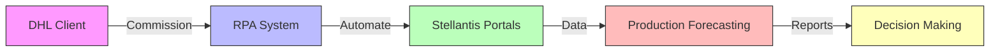

- **🏭 Client**: DHL → Stellantis Automotive Division
- **👨‍💻 Developer**: Vincent Pernarh
- **🎯 Primary Use Case**: Automated order data extraction and Excel report updates for vehicle production forecasting
- **📊 Impact**: Reduces manual processing time from hours to minutes
- **🔄 Frequency**: On-demand execution with multi-model parallel processing

### ✨ Key Features

<table>
<tr>
<td width="50%">

#### 🌐 Web Automation
- ✅ Automated login and navigation
- ✅ Session management
- ✅ Multi-portal integration
- ✅ Error handling & recovery

</td>
<td width="50%">

#### ⚡ Performance
- ✅ Multi-threaded processing
- ✅ Parallel model execution
- ✅ Optimized Excel operations
- ✅ Progress tracking

</td>
</tr>
<tr>
<td width="50%">

#### 📊 Data Processing
- ✅ Automatic file format detection
- ✅ Data transformation pipelines
- ✅ Excel file manipulation (.xlsb, .xlsx)
- ✅ CSV processing with encoding detection

</td>
<td width="50%">

#### 🖥️ User Interface
- ✅ Modern Tkinter GUI
- ✅ Real-time status updates
- ✅ Activity logging
- ✅ Progress visualization

</td>
</tr>
</table>

---

## ⚡ Quick Start Guide

### 🚀 For End Users (Executable)

1. **📂 Download the deployment package** containing:
   - `RPA Process Orders.exe`
   - `credencial.json` (configure with your credentials)
   - `Modelos.json` (vehicle model mappings)
   - `Bases/` folder with template Excel files

2. **⚙️ Configure credentials** in `credencial.json`:
   ```json
   {
       "user": "your_username",
       "password": "your_password",
       "url_order": "https://scmoms-latam.intra.fcagroup.com/LCWEBBR/",
       "url_oss": "http://oss-latam.intra.chrysler.com:7001/jda/home"
   }
   ```

3. **▶️ Double-click** `RPA Process Orders.exe` to launch

4. **🖱️ Click "Processar"** button to start automation

5. **👀 Monitor progress** in the GUI log panel

### 💻 For Developers (Source Code)

```bash
# Clone repository
git clone https://github.com/Vincentpernarh1/RPA-Web-and-Data-processing-Orders.git
cd RPA-Web-and-Data-processing-Orders

# Create virtual environment
python -m venv venv
venv\Scripts\activate

# Install dependencies
pip install playwright pandas openpyxl pyxlsb xlwings xlrd

# Install Playwright browsers
playwright install chromium

# Configure credentials
# Edit credencial.json with your credentials

# Run application
python App.py
```

### ⚠️ Prerequisites
| Requirement | Version | Notes |
|------------|---------|-------|
| 🪟 **Windows OS** | 10/11 | Required for xlwings |
| 🐍 **Python** | 3.8+ | For development |
| 📊 **Microsoft Excel** | 2016+ | Must be installed |
| 🌐 **Network Access** | - | Stellantis intranet |

---

## 🏗️ System Architecture

### 📁 Application Structure

```
📦 RPA Orders/
├── 🎨 App.py                       # Main GUI application and orchestration
├── ⚙️ Tasks.py                     # Core automation tasks and business logic
├── 🔐 credencial.json              # Authentication credentials (⚠️ sensitive)
├── 🚗 Modelos.json                 # Vehicle model configuration
├── 📊 Bases/                       # Excel template files for data updates
│   ├── BASE 265.xlsb               # Model 265 base file
│   ├── BASE 341.xlsb               # Model 341 base file
│   ├── BASE 611.xlsb               # Model 611 base file
│   ├── BASE 675.xlsb               # Model 675 base file
│   ├── GRIGLIA OPCIONAIS *.xlsb    # Options grid configuration
│   └── PREVISÕES X ISTOGRAMA *.xlsb # Forecast vs histogram files
├── 💾 Dados/                       # Downloaded data files (runtime generated)
│   ├── A14_YYYY-MM-DD.xls          # Downloaded A14 data
│   ├── {model}.csv                 # Raw model data
│   └── {model}.xlsx                # Processed model data
├── 🔨 build/                       # Build artifacts (PyInstaller)
└── 📦 dist/                        # Distribution folder (executable)
```

### 🏛️ Component Architecture

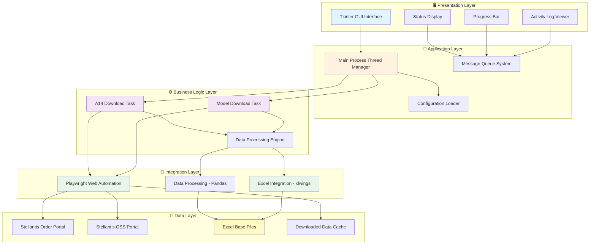

### 🔄 Multi-Threading Architecture

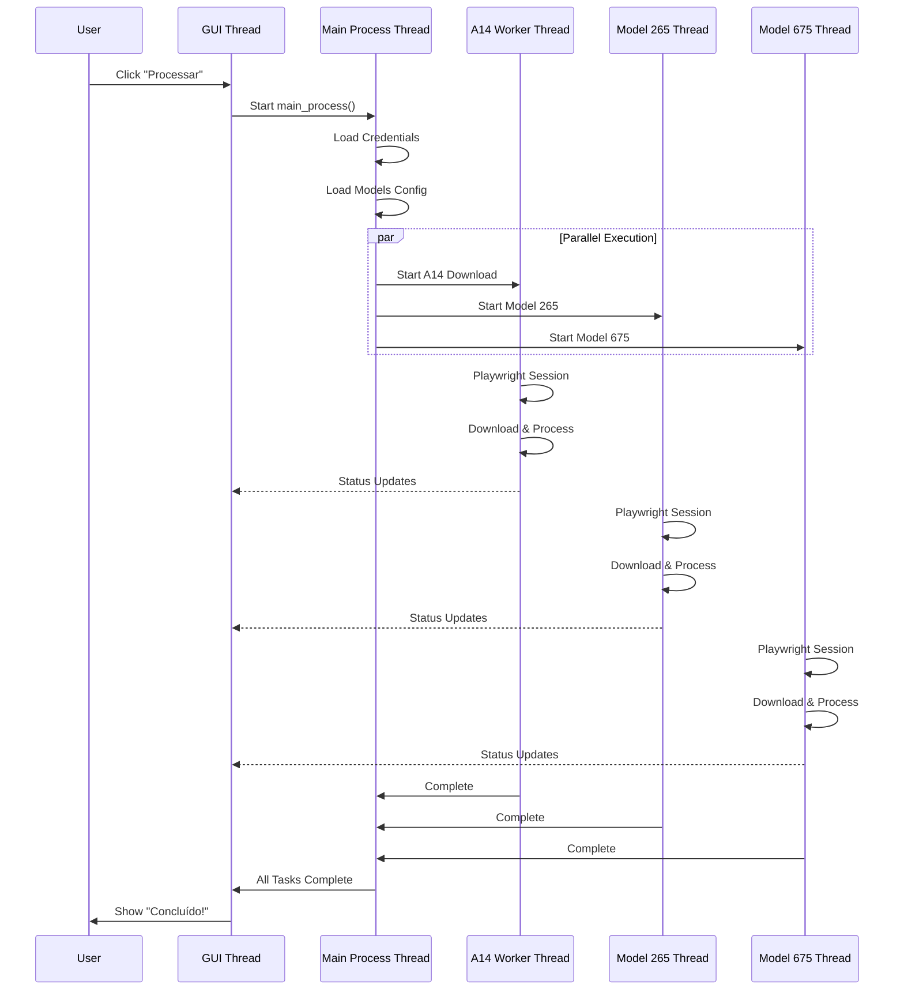

---

## 🔧 Technology Stack

### 📚 Core Dependencies

<table>
<tr>
<th>Category</th>
<th>Technology</th>
<th>Version</th>
<th>Purpose</th>
</tr>
<tr>
<td rowspan="2">🐍 <b>Runtime</b></td>
<td><b>Python</b></td>
<td>3.8+</td>
<td>Main programming language</td>
</tr>
<tr>
<td><b>PyInstaller</b></td>
<td>Latest</td>
<td>Executable packaging</td>
</tr>
<tr>
<td rowspan="2">🖥️ <b>User Interface</b></td>
<td><b>Tkinter</b></td>
<td>Built-in</td>
<td>GUI framework (native)</td>
</tr>
<tr>
<td><b>ttk</b></td>
<td>Built-in</td>
<td>Themed widgets</td>
</tr>
<tr>
<td rowspan="2">🌐 <b>Web Automation</b></td>
<td><b>Playwright</b></td>
<td>Latest</td>
<td>Browser automation & control</td>
</tr>
<tr>
<td><b>Chromium</b></td>
<td>1187+</td>
<td>Playwright browser engine</td>
</tr>
<tr>
<td rowspan="5">📊 <b>Data Processing</b></td>
<td><b>Pandas</b></td>
<td>Latest</td>
<td>Data manipulation & analysis</td>
</tr>
<tr>
<td><b>xlwings</b></td>
<td>Latest</td>
<td>Excel automation (requires Excel)</td>
</tr>
<tr>
<td><b>openpyxl</b></td>
<td>Latest</td>
<td>Excel file reading/writing (.xlsx)</td>
</tr>
<tr>
<td><b>pyxlsb</b></td>
<td>Latest</td>
<td>Binary Excel support (.xlsb)</td>
</tr>
<tr>
<td><b>xlrd</b></td>
<td>Latest</td>
<td>Legacy Excel support (.xls)</td>
</tr>
</table>

### 🔄 Technology Integration Flow

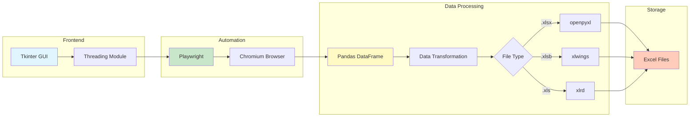

### 💻 System Requirements

| Component | Requirement | Why? |
|-----------|-------------|------|
| **🪟 Operating System** | Windows 10/11 | xlwings requires COM automation (Windows-only) |
| **📊 Microsoft Excel** | 2016 or later | Required for xlwings Excel file manipulation |
| **🐍 Python** | 3.8+ | Modern syntax features & library compatibility |
| **💾 RAM** | 4GB minimum | Multiple browser instances + Excel operations |
| **💿 Disk Space** | 2GB free | Playwright browsers + temporary files |
| **🌐 Network** | Intranet access | Connection to Stellantis portals required |

### 📦 Python Package Dependencies

```python
# Core automation
playwright>=1.40.0
pandas>=2.0.0

# Excel processing
xlwings>=0.30.0
openpyxl>=3.1.0
pyxlsb>=1.0.10
xlrd>=2.0.1

# GUI (built-in)
tkinter  # Standard library

# Build (optional)
pyinstaller>=6.0.0
```

---

## 📦 Installation & Setup

### 🎯 Option 1: Using Pre-built Executable (Recommended for End Users)

#### Step 1: Obtain Deployment Package
Download or obtain the deployment folder containing:
- ✅ `RPA Process Orders.exe` - Main executable
- ✅ `credencial.json` - Credentials template
- ✅ `Modelos.json` - Model configuration
- ✅ `Bases/` folder - Excel template files

#### Step 2: Verify Prerequisites
```powershell
# Check if Microsoft Excel is installed
Get-ItemProperty HKLM:\Software\Microsoft\Windows\CurrentVersion\Uninstall\* | 
    Where-Object { $_.DisplayName -like "*Excel*" }
```

#### Step 3: Configure Credentials
Edit [credencial.json](credencial.json) with your credentials (see [Configuration](#️-configuration))

#### Step 4: Run Application
Double-click `RPA Process Orders.exe` → Click "Processar" button

---

### 💻 Option 2: Running from Source Code (For Developers)

#### Step 1: Clone Repository
```bash
git clone https://github.com/Vincentpernarh1/RPA-Web-and-Data-processing-Orders.git
cd RPA-Web-and-Data-processing-Orders
```

#### Step 2: Create Virtual Environment
```bash
# Create virtual environment
python -m venv venv

# Activate virtual environment
# On Windows (PowerShell)
.\venv\Scripts\Activate.ps1

# On Windows (CMD)
venv\Scripts\activate.bat
```

#### Step 3: Install Dependencies
```bash
# Upgrade pip
python -m pip install --upgrade pip

# Install required packages
pip install playwright pandas openpyxl pyxlsb xlwings xlrd

# Optional: Install PyInstaller for building executable
pip install pyinstaller
```

#### Step 4: Install Playwright Browsers
```bash
# Install Chromium browser for Playwright
playwright install chromium

# Verify installation
playwright --version
```

#### Step 5: Setup Project Structure
```bash
# Create required directories
mkdir Dados
# Note: Bases folder should already contain template files
```

#### Step 6: Configure Application
- Edit [credencial.json](credencial.json) with authentication credentials
- Update [Modelos.json](Modelos.json) if needed

#### Step 7: Run Application
```bash
python App.py
```

### 🔍 Verify Installation

Run this diagnostic script to verify all components:

```python
# verify_setup.py
import sys
import os

print("🔍 RPA System Diagnostic\n" + "="*50)

# Check Python version
print(f"✅ Python Version: {sys.version}")

# Check required packages
packages = ['playwright', 'pandas', 'openpyxl', 'pyxlsb', 'xlwings', 'xlrd']
for pkg in packages:
    try:
        __import__(pkg)
        print(f"✅ {pkg}: Installed")
    except ImportError:
        print(f"❌ {pkg}: NOT FOUND")

# Check directories
dirs = ['Bases', 'Dados']
for d in dirs:
    if os.path.exists(d):
        print(f"✅ Directory '{d}': Exists")
    else:
        print(f"⚠️ Directory '{d}': Missing (will be auto-created)")

# Check configuration files
files = ['credencial.json', 'Modelos.json']
for f in files:
    if os.path.exists(f):
        print(f"✅ Config file '{f}': Found")
    else:
        print(f"❌ Config file '{f}': MISSING")

print("\n" + "="*50)
```

---

## ⚙️ Configuration

### 🔐 1. Credentials Configuration (`credencial.json`)

**📍 Location**: Project root directory  
**🎯 Purpose**: Authentication credentials and portal URLs

#### Template Structure:
```json
{
    "user": "your_username",
    "password": "your_password",
    "url_order": "https://scmoms-latam.intra.fcagroup.com/LCWEBBR/",
    "url_oss": "http://oss-latam.intra.chrysler.com:7001/jda/home"
}
```

#### Field Descriptions:

| Field | Type | Description | Example |
|-------|------|-------------|---------|
| `user` | String | Stellantis portal username | `"john.doe"` |
| `password` | String | Portal password | `"SecurePass123!"` |
| `url_order` | String | Order portal URL (A14 download) | See template |
| `url_oss` | String | OSS portal URL (model forecasts) | See template |

#### ⚠️ Security Notes:
- 🔴 **NEVER commit this file to version control**
- 🔴 **Store credentials securely** (consider environment variables)
- 🔴 **Restrict file permissions** to current user only
- 🔴 **Use strong passwords** and rotate regularly

#### Setting File Permissions (Windows):
```powershell
# Restrict access to current user only
icacls credencial.json /inheritance:r
icacls credencial.json /grant:r "$env:USERNAME:(F)"
```

---

### 🚗 2. Vehicle Models Configuration (`Modelos.json`)

**📍 Location**: Project root directory  
**🎯 Purpose**: Maps vehicle model codes to OSS system identifiers

#### Template Structure:
```json
{
  "265": "3FI_WSL",
  "675": "4JP_WSL",
  "341": "1XH_WSL",
  "611": "XXX_WSL"
}
```

#### Configuration Format:

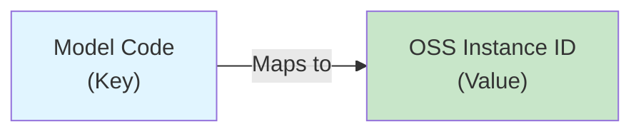

#### Field Mapping:

| Model Code | OSS Instance | Description | Status |
|------------|--------------|-------------|--------|
| `"265"` | `"3FI_WSL"` | Vehicle Model 265 | ✅ Active |
| `"675"` | `"4JP_WSL"` | Vehicle Model 675 | ✅ Active |
| `"341"` | `"1XH_WSL"` | Vehicle Model 341 | ⚠️ Optional |
| `"611"` | `"XXX_WSL"` | Vehicle Model 611 | ❌ Known Issues |

#### 📝 Notes:
- **Active Models**: Currently processing models 265 and 675
- **Model 611**: Skipped automatically due to known portal issues
- **Adding New Models**: Simply add new key-value pairs
- **Removing Models**: Delete or comment out the model entry

#### Example: Adding New Model
```json
{
  "265": "3FI_WSL",
  "675": "4JP_WSL",
  "999": "NEW_WSL"  // ← New model added
}
```

---

### 📊 3. Directory Structure & File Requirements

#### Bases/ Folder Structure

```
📂 Bases/
├── 📄 BASE 265.xlsb          # Model 265 template (REQUIRED)
├── 📄 BASE 341.xlsb          # Model 341 template (REQUIRED)
├── 📄 BASE 611.xlsb          # Model 611 template (REQUIRED)
├── 📄 BASE 675.xlsb          # Model 675 template (REQUIRED)
├── 📄 GRIGLIA OPCIONAIS *.xlsb    # Options grid (REQUIRED)
├── 📄 PREVISÕES X ISTOGRAMA 265.xlsb  # Forecast analysis (optional)
├── 📄 PREVISÕES X ISTOGRAMA 341.xlsb
├── 📄 PREVISÕES X ISTOGRAMA 611.xlsb
└── 📄 PREVISÕES X ISTOGRAMA 675.xlsb
```

#### Required Excel Sheet Structure

Each `BASE {model}.xlsb` file **MUST** contain:

| Sheet Name | Purpose | Auto-Created? |
|------------|---------|---------------|
| `ARQUIVO PREVISÕES` | Forecast data updates | ❌ Must exist |
| `A14` | Optional package data | ✅ Created if missing |

#### Dados/ Folder (Auto-Generated)

```
📂 Dados/  (Created at runtime)
├── 📄 A14_2026-02-17.xls     # Downloaded A14 data (dated)
├── 📄 265.csv                # Raw model data
├── 📄 265.xlsx               # Processed model data
├── 📄 675.csv
└── 📄 675.xlsx
```

**🗑️ Cleanup**: Files in `Dados/` folder are cached for 5 days, then re-downloaded

---

### 🔧 4. Advanced Configuration (Optional)

#### Environment Variables (Recommended for Production)

Instead of `credencial.json`, use environment variables:

```python
# In App.py or Tasks.py
import os

credentials = {
    "user": os.getenv('STELLANTIS_USER'),
    "password": os.getenv('STELLANTIS_PASSWORD'),
    "url_order": os.getenv('STELLANTIS_URL_ORDER'),
    "url_oss": os.getenv('STELLANTIS_URL_OSS')
}
```

Set environment variables:
```powershell
# Windows PowerShell
$env:STELLANTIS_USER = "your_username"
$env:STELLANTIS_PASSWORD = "your_password"

# Or permanently via System Properties → Environment Variables
```

#### Browser Configuration

Modify browser launch parameters in [Tasks.py](Tasks.py):

```python
browser = p.chromium.launch(
    headless=False,              # Set True for background mode
    executable_path=chromium_path,
    args=[
        "--start-maximized",
        "--disable-dev-shm-usage"  # Reduce memory usage
    ]
)
```

---

## 🧩 Core Components

### 📱 Component Overview

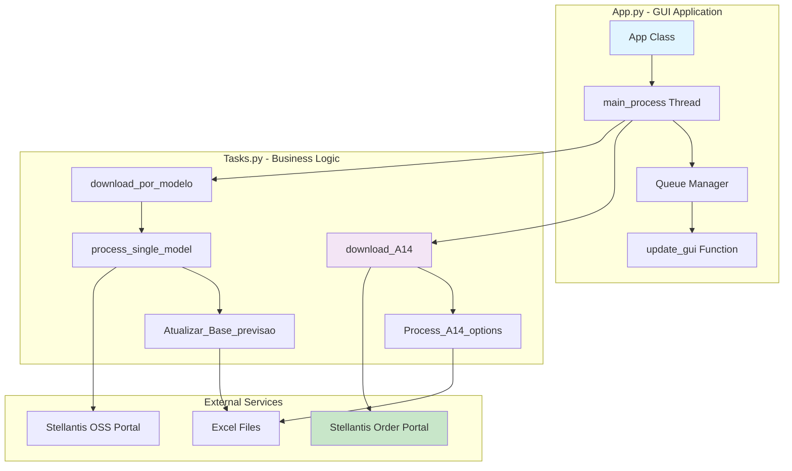

---

### 🖥️ App.py - Main Application

#### 📦 Class: `App`

**Purpose**: Tkinter-based GUI application with real-time monitoring

##### UI Components:

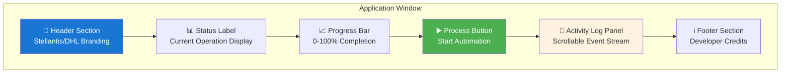

##### Key Features:

| Feature | Description | Implementation |
|---------|-------------|----------------|
| **Real-time Updates** | Status messages displayed instantly | Queue-based messaging |
| **Thread Safety** | GUI doesn't freeze during processing | Background thread execution |
| **Progress Tracking** | Visual completion percentage | Progress bar with queue updates |
| **Activity Logging** | Detailed event stream | ScrolledText widget with auto-scroll |
| **Error Handling** | Graceful error display | Try-except with user notifications |

##### Code Example:
```python
class App:
    def __init__(self, root):
        self.root = root
        self.queue = queue.Queue()
        
        # UI Setup
        self.setup_header()
        self.setup_status_area()
        self.setup_process_button()
        self.setup_log_panel()
        
    def start_process(self):
        # Disable button during processing
        self.process_button.config(state=tk.DISABLED)
        
        # Start background thread
        thread = threading.Thread(target=main_process, args=(self.queue,))
        thread.daemon = True
        thread.start()
```

---

#### ⚙️ Function: `main_process(q: queue.Queue)`

**Purpose**: Orchestrates the entire automation workflow

##### Workflow Diagram:

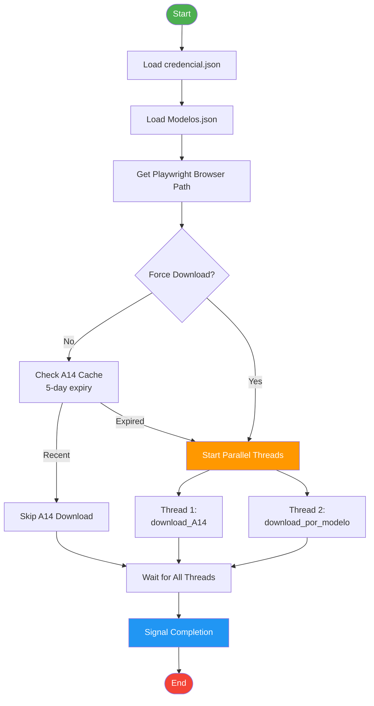

##### Thread Communication:

```python
# Queue message format
queue.put(("status", "Current operation..."))  # Status update
queue.put(("progress", 50))                     # Progress percentage
queue.put(("log", "Detailed log message"))     # Log entry
```

---

### ⚙️ Tasks.py - Business Logic

#### 🌐 Function: `download_A14(...)`

**Purpose**: Automates A14 optional package data download

##### Parameters:
- `url_order` (str): Order portal URL
- `q` (Queue): Message queue for GUI updates
- `username` (str): Portal username
- `password` (str): Portal password
- `chromium_path` (str): Path to Chromium executable
- `force` (bool): Force download ignoring cache

##### Workflow:

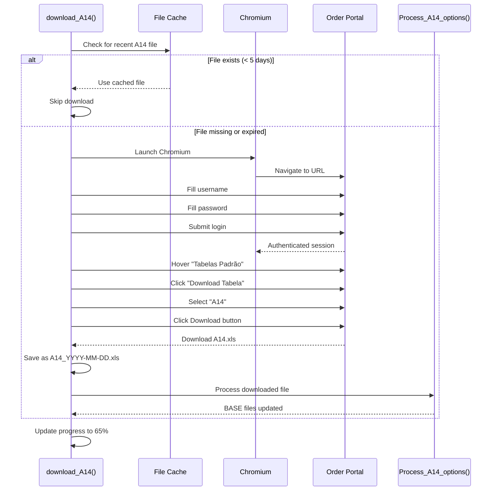

##### Error Handling:
```python
try:
    # Automation steps
    page.goto(url_order, timeout=100000)
    # ... login and download ...
except TimeoutError:
    q.put(("status", "❌ Timeout ao acessar portal"))
except Exception as e:
    q.put(("status", f"❌ ERRO: {e}"))
finally:
    if browser:
        browser.close()
```

---

#### 📊 Function: `Process_A14_options(file_path, q)`

**Purpose**: Transforms A14 data and updates all BASE Excel files

##### Data Transformation Pipeline:

```mermaid
flowchart LR
    INPUT[A14.xls File] --> LOAD[Load File<br/>Multi-format Support]
    LOAD --> FILTER[Filter CODICE_FAMIGLIA<br/>== 'PKG']
    FILTER --> IDENTIFY[Identify Optional Columns<br/>CODICE_OPTIONAL_*]
    IDENTIFY --> SPLIT[Split Columns]
    
    SPLIT --> PACK[First Column<br/>→ PACK]
    SPLIT --> CONTENT[Remaining Columns<br/>→ CONTEÚDO]
    
    CONTENT --> FORMAT[Format: *value1*value2*]
    PACK --> COMBINE[Combine Data]
    FORMAT --> COMBINE
    
    COMBINE --> SCAN[Scan Bases/ Folder]
    SCAN --> UPDATE[Update Each BASE File]
    UPDATE --> SHEET[Create/Clear 'A14' Sheet]
    SHEET --> WRITE[Write Headers + Data]
    WRITE --> SAVE[Save & Close]
    
    style INPUT fill:#e1f5ff
    style FILTER fill:#fff3e0
    style COMBINE fill:#f3e5f5
    style SAVE fill:#c8e6c9
```

##### File Format Support:

| Format | Extension | Engine | Notes |
|--------|-----------|--------|-------|
| Excel 2007+ | .xlsx, .xlsm | openpyxl | Full support |
| Excel 2003 | .xls | xlrd | Legacy format |
| Excel Binary | .xlsb | pyxlsb | Performance optimized |
| CSV | .csv | pandas | Auto-detect encoding & delimiter |

##### Data Transformation Example:

**Input Table:**
```
| CODICE_FAMIGLIA | CODICE_OPTIONAL_1 | CODICE_OPTIONAL_2 | CODICE_OPTIONAL_3 |
|-----------------|-------------------|-------------------|-------------------|
| PKG             | ABC123            | OPT100            | OPT200            |
| PKG             | XYZ456            | OPT300            |                   |
| OTHER           | IGNORE            | IGNORE            | IGNORE            |
```

**Output Table (written to A14 sheet):**
```
| PACK   | CONTEÚDO          |
|--------|-------------------|
| ABC123 | *OPT100*OPT200*   |
| XYZ456 | *OPT300*          |
```

##### Excel Update Process:
```python
# For each BASE file in Bases/ folder:
1. Open workbook (invisible Excel instance)
2. Create or clear 'A14' sheet
3. Format columns as text (@)
4. Write headers: ['PACK', 'CONTEÚDO']
5. Write transformed data
6. AutoFit columns
7. Save and close
```

---

#### 🔄 Function: `download_por_modelo(...)`

**Purpose**: Thread manager for parallel model processing

##### Thread Orchestration:

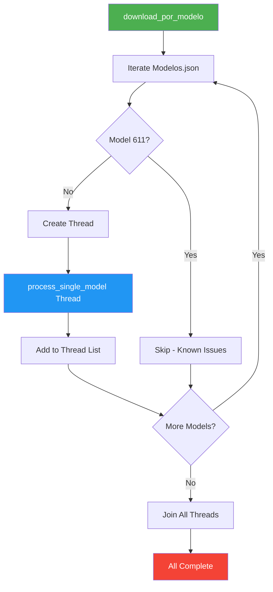

##### Benefits of Multi-Threading:

| Aspect | Single-Threaded | Multi-Threaded | Improvement |
|--------|----------------|----------------|-------------|
| **Processing Time** | 15-20 min | 5-10 min | ~50% faster |
| **Browser Isolation** | ❌ Conflicts | ✅ Independent | Safer |
| **Resource Usage** | Low | Moderate | Trade-off |
| **User Experience** | Sequential | Parallel | Better |

---

#### 🚗 Function: `process_single_model(...)`

**Purpose**: Downloads and processes forecast data for one vehicle model

##### Complete Workflow:

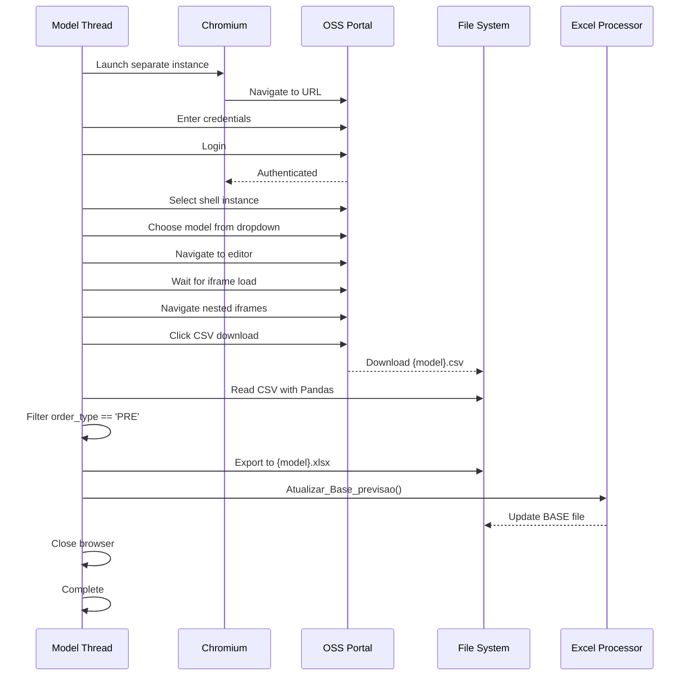

##### CSV Filtering Logic:
```python
# Read downloaded CSV
df = pd.read_csv(f"Dados/{model}.csv")

# Filter for forecast orders only
df_forecast = df[df['order_type'] == 'PRE']

# Export filtered data
df_forecast.to_excel(f"Dados/{model}.xlsx", index=False)
```

---

#### 📝 Function: `Atualizar_Base_previsao(df, model_key, q)`

**Purpose**: Updates BASE Excel files with forecast data

##### Update Process:

```mermaid
flowchart TD
    START[Receive DataFrame] --> SEARCH[Search Bases/ Folder]
    SEARCH --> MATCH[Find BASE*{model}*.xlsb]
    MATCH --> OPEN[Open Excel Workbook<br/>Invisible Mode]
    OPEN --> SHEET[Access 'ARQUIVO PREVISÕES' Sheet]
    
    SHEET --> CLEAR[Clear Range B2:Y1048576]
    CLEAR --> REMOVE[Remove Header Row from DataFrame]
    REMOVE --> PASTE[Paste Data Starting at B2]
    
    PASTE --> FORMAT[Copy Format from B2]
    FORMAT --> APPLY[Apply Format to All Rows]
    APPLY --> FORMULA[AutoFill Formulas Z, AA, AB]
    FORMULA --> SAVE[Save Workbook]
    SAVE --> CLOSE[Close Excel]
    CLOSE --> END[Complete]
    
    style START fill:#4caf50,color:#fff
    style PASTE fill:#ff9800,color:#fff
    style SAVE fill:#2196f3,color:#fff
    style END fill:#f44336,color:#fff
```

##### Excel Range Operations:

| Operation | Range | Purpose |
|-----------|-------|---------|
| **Clear Data** | B2:Y1048576 | Remove old forecast data |
| **Paste Data** | B2:Y[last_row] | Insert new forecast data (no header) |
| **Copy Format** | B2 (row) | Source formatting template |
| **Apply Format** | B2:Y[last_row] | Preserve styling consistency |
| **AutoFill Formulas** | Z2:AB[last_row] | Propagate calculation formulas |

##### xlwings Usage:
```python
import xlwings as xw

# Open Excel invisibly
app = xw.App(visible=False, add_book=False)
app.display_alerts = False
app.screen_updating = False

wb = app.books.open(file_path, update_links=False)
ws = wb.sheets['ARQUIVO PREVISÕES']

# Clear old data
ws.range('B2:Y1048576').clear_contents()

# Paste new data (without header)
ws.range('B2').value = df.iloc[1:].values

# Copy format from first row to all others
src_range = ws.range('B2:Y2')
dst_range = ws.range(f'B2:Y{len(df)}')
src_range.copy(dst_range)

# AutoFill formulas
for col in ['Z', 'AA', 'AB']:
    src = ws.range(f'{col}2')
    dst = ws.range(f'{col}2:{col}{len(df)}')
    src.autofill(dst)

wb.save()
wb.close()
```
---

## 🔄 Data Flow & Workflows

### 🌊 Complete System Workflow

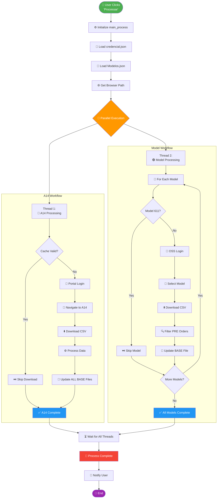

---

### 📊 A14 Data Transformation Flow

```mermaid
flowchart LR
    subgraph "Input Data"
        A[A14.xls<br/>Raw Download]
    end
    
    subgraph "Processing Steps"
        B[Load File<br/>Auto-detect Format]
        C[Filter Rows<br/>CODICE_FAMIGLIA = 'PKG']
        D[Identify Columns<br/>CODICE_OPTIONAL_*]
        E[Extract PACK<br/>First Column]
        F[Extract CONTEÚDO<br/>Remaining Columns]
        G[Format CONTEÚDO<br/>*val1*val2*...]
        H[Create DataFrame<br/>PACK | CONTEÚDO]
    end
    
    subgraph "Output Targets"
        I[BASE 265.xlsb<br/>Sheet: A14]
        J[BASE 341.xlsb<br/>Sheet: A14]
        K[BASE 611.xlsb<br/>Sheet: A14]
        L[BASE 675.xlsb<br/>Sheet: A14]
    end
    
    A --> B --> C --> D
    D --> E
    D --> F --> G
    E --> H
    G --> H
    H --> I
    H --> J
    H --> K
    H --> L
    
    style A fill:#e1f5ff
    style H fill:#fff3e0
    style I fill:#c8e6c9
    style J fill:#c8e6c9
    style K fill:#c8e6c9
    style L fill:#c8e6c9
```

#### Example Transformation:

**📥 Input (A14.xls):**
```
╔═══════════════════╦═══════════════════╦═══════════════════╦═══════════════════╗
║ CODICE_FAMIGLIA   ║ CODICE_OPTIONAL_1 ║ CODICE_OPTIONAL_2 ║ CODICE_OPTIONAL_3 ║
╠═══════════════════╬═══════════════════╬═══════════════════╬═══════════════════╣
║ PKG               ║ PACK001           ║ OPT_A             ║ OPT_B             ║
║ PKG               ║ PACK002           ║ OPT_C             ║ OPT_D             ║
║ PKG               ║ PACK003           ║ OPT_E             ║                   ║
║ OTHER             ║ IGNORE            ║ IGNORE            ║ IGNORE            ║
╚═══════════════════╩═══════════════════╩═══════════════════╩═══════════════════╝
```

**📤 Output (BASE files → A14 sheet):**
```
╔═════════╦═══════════════╗
║ PACK    ║ CONTEÚDO      ║
╠═════════╬═══════════════╣
║ PACK001 ║ *OPT_A*OPT_B* ║
║ PACK002 ║ *OPT_C*OPT_D* ║
║ PACK003 ║ *OPT_E*       ║
╚═════════╩═══════════════╝
```

---

### 🚗 Model Forecast Data Flow

```mermaid
flowchart LR
    subgraph "Web Portal"
        A[OSS Portal<br/>Model Selection]
    end
    
    subgraph "Download"
        B[Download<br/>{model}.csv]
    end
    
    subgraph "Processing"
        C[Load CSV<br/>Pandas]
        D[Filter<br/>order_type = 'PRE']
        E[Export<br/>{model}.xlsx]
    end
    
    subgraph "Excel Update"
        F[Open BASE {model}.xlsb]
        G[Access Sheet<br/>ARQUIVO PREVISÕES]
        H[Clear Range<br/>B2:Y1048576]
        I[Paste Data<br/>Starting B2]
        J[Format Cells<br/>Copy from B2]
        K[AutoFill Formulas<br/>Z, AA, AB]
        L[Save & Close]
    end
    
    A --> B --> C --> D --> E --> F
    F --> G --> H --> I --> J --> K --> L
    
    style A fill:#e1f5ff
    style D fill:#fff3e0
    style I fill:#f3e5f5
    style L fill:#c8e6c9
```

#### Filtering Logic:

**📥 Input CSV (Model 265):**
```
╔══════════╦════════════╦═══════╦══════════╦════════════╗
║ order_id ║ order_type ║ model ║ quantity ║    date    ║
╠══════════╬════════════╬═══════╬══════════╬════════════╣
║ 12345    ║ PRE        ║ 265   ║ 50       ║ 2026-03-01 ║ ✅ Keep
║ 12346    ║ ACT        ║ 265   ║ 30       ║ 2026-02-28 ║ ❌ Filter out
║ 12347    ║ PRE        ║ 265   ║ 25       ║ 2026-03-05 ║ ✅ Keep
║ 12348    ║ ACT        ║ 265   ║ 15       ║ 2026-02-27 ║ ❌ Filter out
║ 12349    ║ PRE        ║ 265   ║ 40       ║ 2026-03-10 ║ ✅ Keep
╚══════════╩════════════╩═══════╩══════════╩════════════╝
```

**📤 Output XLSX (Forecast Only):**
```
╔══════════╦════════════╦═══════╦══════════╦════════════╗
║ order_id ║ order_type ║ model ║ quantity ║    date    ║
╠══════════╬════════════╬═══════╬══════════╬════════════╣
║ 12345    ║ PRE        ║ 265   ║ 50       ║ 2026-03-01 ║
║ 12347    ║ PRE        ║ 265   ║ 25       ║ 2026-03-05 ║
║ 12349    ║ PRE        ║ 265   ║ 40       ║ 2026-03-10 ║
╚══════════╩════════════╩═══════╩══════════╩════════════╝
```

---

### 🔀 Thread Execution Timeline

```mermaid
gantt
    title RPA Process Execution Timeline
    dateFormat  ss
    axisFormat %S s
    
    section GUI Thread
    User clicks Process    :active, gui1, 00, 1s
    Monitor Queue          :active, gui2, 01, 59s
    Display Complete       :active, gui3, 59, 1s
    
    section Main Thread
    Load Config            :main1, 01, 2s
    Start A14 Thread       :main2, 03, 1s
    Start Model Threads    :main3, 04, 1s
    Wait for Completion    :main4, 05, 54s
    Signal Done            :main5, 59, 1s
    
    section A14 Thread
    Launch Browser         :a14_1, 04, 3s
    Login                  :a14_2, 07, 5s
    Navigate & Download    :a14_3, 12, 10s
    Process Data           :a14_4, 22, 8s
    Update BASE Files      :a14_5, 30, 25s
    Complete               :crit, a14_6, 55, 1s
    
    section Model 265 Thread
    Launch Browser         :m265_1, 05, 3s
    Login to OSS           :m265_2, 08, 5s
    Select Model           :m265_3, 13, 4s
    Download CSV           :m265_4, 17, 12s
    Filter & Process       :m265_5, 29, 5s
    Update BASE 265        :m265_6, 34, 20s
    Complete               :crit, m265_7, 54, 1s
    
    section Model 675 Thread
    Launch Browser         :m675_1, 05, 3s
    Login to OSS           :m675_2, 08, 5s
    Select Model           :m675_3, 13, 4s
    Download CSV           :m675_4, 17, 13s
    Filter & Process       :m675_5, 30, 5s
    Update BASE 675        :m675_6, 35, 24s
    Complete               :crit, m675_7, 59, 1s
```

**⏱️ Timing Notes:**
- **Total Duration**: ~60 seconds (1 minute) with parallel execution
- **Sequential Would Take**: ~150 seconds (2.5 minutes)
- **Performance Gain**: 60% reduction in total time
- **Bottleneck**: Excel file updates (largest time consumer)

---

### 💾 File System Interactions

```mermaid
graph TB
    subgraph "Configuration Files"
        CRED[credencial.json<br/>🔐 Read at startup]
        MODEL[Modelos.json<br/>📋 Read at startup]
    end
    
    subgraph "Download Cache"
        CACHE[Dados/<br/>💾 Runtime storage]
        A14FILE[A14_YYYY-MM-DD.xls<br/>📅 5-day cache]
        MODELCSV[{model}.csv<br/>📊 Raw data]
        MODELXLSX[{model}.xlsx<br/>📈 Filtered data]
    end
    
    subgraph "Template Files"
        BASES[Bases/<br/>📂 Excel templates]
        BASE265[BASE 265.xlsb]
        BASE341[BASE 341.xlsb]
        BASE611[BASE 611.xlsb]
        BASE675[BASE 675.xlsb]
    end
    
    APP[RPA Application] -->|Read| CRED
    APP -->|Read| MODEL
    
    APP -->|Write| A14FILE
    APP -->|Write| MODELCSV
    APP -->|Write| MODELXLSX
    
    APP -->|Read/Write| BASE265
    APP -->|Read/Write| BASE341
    APP -->|Read/Write| BASE611
    APP -->|Read/Write| BASE675
    
    A14FILE -.->|Cache Check| APP
    
    CACHE --> A14FILE
    CACHE --> MODELCSV
    CACHE --> MODELXLSX
    
    BASES --> BASE265
    BASES --> BASE341
    BASES --> BASE611
    BASES --> BASE675
    
    style CRED fill:#ffcdd2
    style CACHE fill:#fff9c4
    style BASES fill:#c8e6c9
```

---

### 🔄 Caching Strategy

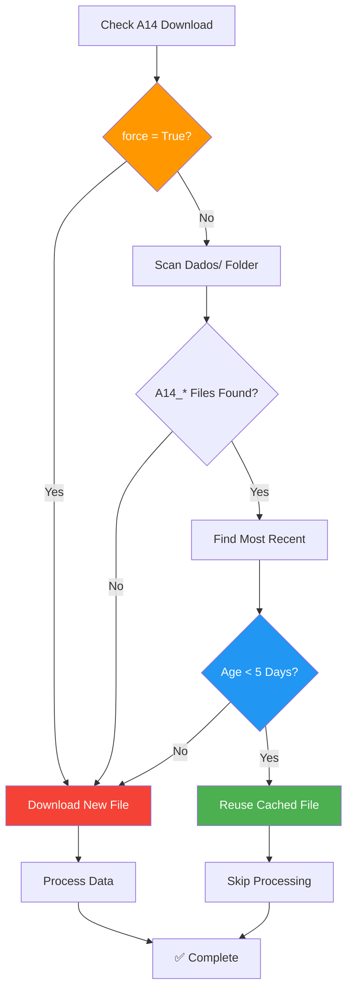

**Benefits:**
- ⚡ Faster execution when data is fresh
- 💰 Reduces portal load/bandwidth usage
- 🔒 Maintains data recency (5-day expiry)
- 🛠️ Can be overridden with `force=True`

---

## � Features & Functionality

### 🎯 Core Features

<table>
<tr>
<td width="50%" valign="top">

#### 🌐 Web Automation
- ✅ **Automated Login**  
  Seamless authentication to multiple portals
  
- ✅ **Session Management**  
  Maintains active browser sessions
  
- ✅ **Error Recovery**  
  Handles timeouts and connection issues
  
- ✅ **Multi-Portal Support**  
  - Order Portal (A14 data)
  - OSS Portal (Model forecasts)

</td>
<td width="50%" valign="top">

#### ⚡ Performance
- ✅ **Multi-Threading**  
  Parallel execution of independent tasks
  
- ✅ **Smart Caching**  
  5-day cache for A14 data
  
- ✅ **Optimized Excel I/O**  
  Invisible Excel instances for speed
  
- ✅ **Progress Tracking**  
  Real-time % completion updates

</td>
</tr>
<tr>
<td width="50%" valign="top">

#### 📊 Data Processing
- ✅ **Multi-Format Support**  
  .xlsx, .xlsb, .xls, .csv
  
- ✅ **Encoding Detection**  
  Auto-detect UTF-8/Latin-1
  
- ✅ **Data Filtering**  
  Extract forecast orders (PRE type)
  
- ✅ **Format Preservation**  
  Maintains Excel styles & formulas

</td>
<td width="50%" valign="top">

#### 🖥️ User Experience
- ✅ **Modern GUI**  
  Tkinter-based professional interface
  
- ✅ **Activity Logging**  
  Scrollable real-time event stream
  
- ✅ **Status Updates**  
  Clear progress indicators
  
- ✅ **Error Notifications**  
  User-friendly error messages

</td>
</tr>
</table>

---

### 🛠️ Advanced Capabilities

#### 1. Intelligent Caching System

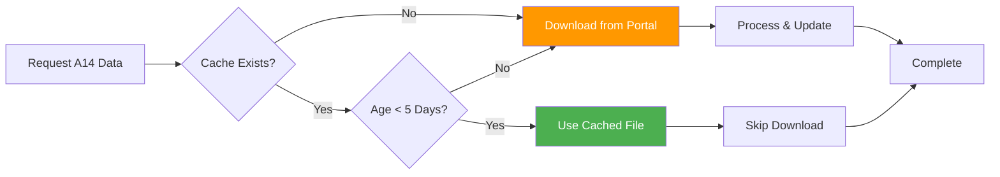

**Benefits:**
- 🚀 Faster execution (skip download when data is fresh)
- 💰 Reduced bandwidth usage
- 🔄 Automatic refresh after 5 days
- 🛠️ Force download option available

---

#### 2. Multi-Format File Processing

| Format | Extension | Engine | Read | Write | Notes |
|--------|-----------|--------|:----:|:-----:|-------|
| Excel 2007+ | .xlsx | openpyxl | ✅ | ✅ | Standard format |
| Excel 2007+ | .xlsm | openpyxl | ✅ | ✅ | With macros |
| Excel Binary | .xlsb | xlwings/pyxlsb | ✅ | ✅ | Performance optimized |
| Excel 97-2003 | .xls | xlrd | ✅ | ❌ | Legacy read-only |
| CSV | .csv | pandas | ✅ | ✅ | Auto-detect delimiter |

---

#### 3. Excel Automation Features

##### Formula Preservation
```python
# Automatically preserves and extends formulas
# Source: Z2, AA2, AB2
# Target: Z2:Z[last_row], AA2:AA[last_row], AB2:AB[last_row]
```

##### Format Cloning
```python
# Copies all formatting from template row to data rows:
# - Cell colors & borders
# - Number formats
# - Font styles & sizes
# - Column widths
```

##### Sheet Management
- ✅ Auto-create missing sheets
- ✅ Clear existing data without deleting formulas
- ✅ Preserve workbook structure
- ✅ Update pivot table sources

---

#### 4. Thread-Safe Queue Messaging

```mermaid
sequenceDiagram
    participant Worker as Worker Thread
    participant Queue as Message Queue
    participant GUI as GUI Thread
    
    Worker->>Queue: put(("status", "Processing..."))
    Queue-->>GUI: get_nowait()
    GUI->>GUI: Update Status Label
    
    Worker->>Queue: put(("progress", 50))
    Queue-->>GUI: get_nowait()
    GUI->>GUI: Update Progress Bar
    
    Worker->>Queue: put(("log", "Downloaded file"))
    Queue-->>GUI: get_nowait()
    GUI->>GUI: Append to Log Panel
```

**Message Types:**
- `("status", text)` - Updates main status label
- `("progress", percentage)` - Updates progress bar
- `("log", message)` - Adds entry to activity log

---

### 📈 Performance Metrics

| Metric | Value | Notes |
|--------|-------|-------|
| **Total Execution Time** | 5-10 min | With 2 models in parallel |
| **A14 Processing** | 2-5 min | Includes all BASE file updates |
| **Single Model Processing** | 3-7 min | Download + filter + update |
| **Excel Update (per file)** | 10-30 sec | Depends on data size |
| **Memory Usage** | 200-500 MB | Per Playwright instance |
| **Cache Hit Rate** | ~70% | With 5-day expiry |

---

### 🔒 Safety Features

#### Error Handling Matrix

| Error Type | Detection | Recovery | User Notification |
|-----------|-----------|----------|-------------------|
| **Network Timeout** | Playwright timeout | Retry logic | ⚠️ Warning message |
| **Login Failure** | Page element check | Halt process | ❌ Error message |
| **File Not Found** | File existence check | Create directory | ⚠️ Auto-created |
| **Excel Error** | Exception catch | Close Excel gracefully | ❌ Error with details |
| **Data Format Error** | Pandas validation | Skip malformed rows | ⚠️ Warning + continue |

#### Data Integrity Checks

```python
# Before updating BASE files:
✓ Verify sheet exists or create
✓ Validate data format
✓ Check for empty datasets
✓ Preserve existing formulas in non-data columns
✓ Backup mechanism (Excel auto-save)
```

---

## 🔨 Build & Deployment

### 📦 Creating Standalone Executable

#### One-Command Build

```powershell
pyinstaller --noconfirm --onefile --windowed --noconsole `
  --name "RPA Process Orders" `
  --icon "C:/Users/perna/Desktop/STALLANTIS/RPA Orders/process_oders_icon.ico" `
  --add-data "C:\Users\perna\AppData\Local\ms-playwright\chromium-1187\chrome-win;ms-playwright\chromium-1187\chrome-win" `
  App.py
```

#### Build Parameters Explained

| Parameter | Value | Purpose |
|-----------|-------|---------|
| `--noconfirm` | - | Overwrite output without prompting |
| `--onefile` | - | Bundle into single .exe (not folder) |
| `--windowed` | - | GUI app (no console window) |
| `--noconsole` | - | Suppress console completely |
| `--name` | "RPA Process Orders" | Executable filename |
| `--icon` | .ico file path | Application icon |
| `--add-data` | Chromium path | Include browser binaries |

---

### 🏗️ Build Process Workflow

```mermaid
flowchart TD
    START([📝 Prepare Source Code]) --> CHECK[✓ Verify Dependencies]
    CHECK --> CLEAN[🗑️ Clean Previous Build]
    CLEAN --> PYINST[🔨 Run PyInstaller]
    
    PYINST --> ANALYZE[📊 Analyze Imports]
    ANALYZE --> COLLECT[📦 Collect Dependencies]
    COLLECT --> BUNDLE[📦 Bundle Resources]
    
    BUNDLE --> CHROMIUM{Include Chromium?}
    CHROMIUM -->|Yes| COPY[📋 Copy Browser Files]
    CHROMIUM -->|No| SKIP[⏭️ Skip]
    
    COPY --> COMPILE[⚙️ Compile Python Code]
    SKIP --> COMPILE
    
    COMPILE --> PACKAGE[📦 Create Executable]
    PACKAGE --> TEST[🧪 Test Executable]
    
    TEST --> VERIFY{Works?}
    VERIFY -->|Yes| DEPLOY[✅ Ready for Deployment]
    VERIFY -->|No| DEBUG[🐛 Debug Issues]
    
    DEBUG --> PYINST
    DEPLOY --> END([🎉 Build Complete])
    
    style START fill:#4caf50,color:#fff
    style DEPLOY fill:#2196f3,color:#fff
    style END fill:#f44336,color:#fff
```

---

### 📋 Pre-Build Checklist

- [ ] **Python 3.8+** installed
- [ ] **All dependencies** installed via pip
- [ ] **Playwright Chromium** installed (`playwright install chromium`)
- [ ] **PyInstaller** installed (`pip install pyinstaller`)
- [ ] **Icon file** exists at specified path
- [ ] **Chromium path** is correct for your system
- [ ] **Source code** tested and functional

---

### 🛠️ Build Steps (Detailed)

#### Step 1: Verify Chromium Installation

```powershell
# Find Playwright Chromium version
python -c "from playwright.sync_api import sync_playwright; p = sync_playwright().start(); print(p.chromium.executable_path); p.stop()"

# Expected output example:
# C:\Users\YourUser\AppData\Local\ms-playwright\chromium-1187\chrome-win\chrome.exe
```

#### Step 2: Clean Previous Builds

```powershell
# Remove old build artifacts
Remove-Item -Recurse -Force build, dist -ErrorAction SilentlyContinue
Remove-Item -Force "RPA Process Orders.spec" -ErrorAction SilentlyContinue
```

#### Step 3: Run PyInstaller

```powershell
# Navigate to project directory
cd "C:\Users\perna\Desktop\STALLANTIS\RPA Orders"

# Run build command (adjust paths as needed)
pyinstaller --noconfirm --onefile --windowed --noconsole `
  --name "RPA Process Orders" `
  --icon "process_oders_icon.ico" `
  --add-data "$env:LOCALAPPDATA\ms-playwright\chromium-1187\chrome-win;ms-playwright\chromium-1187\chrome-win" `
  App.py
```

#### Step 4: Test the Executable

```powershell
# Test the built executable
.\dist\"RPA Process Orders.exe"
```

---

### 🎁 Deployment Package Structure

```
📦 RPA_Process_Orders_v1.0/
├── 📄 RPA Process Orders.exe        # Main executable
├── 📄 README.txt                    # Quick start guide
├── 📄 credencial.json.template      # Template for credentials
├── 📄 Modelos.json                  # Model configuration
├── 📂 Bases/                        # Excel template files
│   ├── BASE 265.xlsb
│   ├── BASE 341.xlsb
│   ├── BASE 611.xlsb
│   ├── BASE 675.xlsb
│   └── GRIGLIA OPCIONAIS *.xlsb
└── 📂 Dados/                        # (Created at runtime)
```

---

### 📤 Distribution Checklist

Before distributing to end users:

- [ ] ✅ **Test executable** on clean Windows system
- [ ] ✅ **Verify Excel** is installed on target machines
- [ ] ✅ **Include template** credencial.json (without real credentials)
- [ ] ✅ **Document setup** process in README.txt
- [ ] ✅ **Test with actual** Stellantis portals
- [ ] ✅ **Verify BASE files** are included
- [ ] ✅ **Create installation** instructions
- [ ] ✅ **Define support** contact information

---

### 🚀 Installation on Target Machine

#### For End Users:

1. **Extract Package**
   ```
   Unzip RPA_Process_Orders_v1.0.zip to desired location
   ```

2. **Configure Credentials**
   ```
   Rename credencial.json.template to credencial.json
   Edit with your username and password
   ```

3. **Verify Excel**
   ```
   Ensure Microsoft Excel 2016+ is installed
   ```

4. **Run Application**
   ```
   Double-click "RPA Process Orders.exe"
   Click "Processar" to start
   ```

---

### 🔧 Advanced Build Options

#### Including Python Packages Explicitly

Create a `.spec` file for more control:

```python
# RPA Process Orders.spec
a = Analysis(
    ['App.py'],
    pathex=['C:\\Users\\perna\\Desktop\\STALLANTIS\\RPA Orders'],
    binaries=[],
    datas=[
        ('C:\\Users\\perna\\AppData\\Local\\ms-playwright\\chromium-1187\\chrome-win', 'ms-playwright\\chromium-1187\\chrome-win'),
    ],
    hiddenimports=['playwright', 'pandas', 'xlwings', 'openpyxl', 'pyxlsb', 'xlrd'],
    hookspath=[],
    runtime_hooks=[],
    excludes=[],
    win_no_prefer_redirects=False,
    win_private_assemblies=False,
    cipher=None,
    noarchive=False
)

pyz = PYZ(a.pure, a.zipped_data, cipher=None)

exe = EXE(
    pyz,
    a.scripts,
    a.binaries,
    a.zipfiles,
    a.datas,
    [],
    name='RPA Process Orders',
    debug=False,
    bootloader_ignore_signals=False,
    strip=False,
    upx=True,
    upx_exclude=[],
    runtime_tmpdir=None,
    console=False,
    icon='process_oders_icon.ico'
)
```

Then build with:
```powershell
pyinstaller "RPA Process Orders.spec"
```

---

## 🐛 Troubleshooting

### 🔍 Diagnostic Overview

```mermaid
flowchart TD
    START[❌ Error Occurred] --> TYPE{Error Category?}
    
    TYPE -->|Browser| BROWSER[🌐 Browser Issues]
    TYPE -->|Excel| EXCEL[📊 Excel Issues]
    TYPE -->|File| FILE[📁 File Issues]
    TYPE -->|Network| NETWORK[🌐 Network Issues]
    TYPE -->|Login| LOGIN[🔐 Authentication Issues]
    
    BROWSER --> B1[Check Playwright Installation]
    EXCEL --> E1[Verify Excel Installation]
    FILE --> F1[Check File Permissions]
    NETWORK --> N1[Test Portal Connectivity]
    LOGIN --> L1[Verify Credentials]
    
    B1 --> B2[Reinstall Chromium]
    E1 --> E2[Run as Administrator]
    F1 --> F2[Close Open Files]
    N1 --> N2[Check VPN/Firewall]
    L1 --> L2[Update credencial.json]
    
    B2 --> RESOLVE[✅ Resolved]
    E2 --> RESOLVE
    F2 --> RESOLVE
    N2 --> RESOLVE
    L2 --> RESOLVE
    
    style START fill:#f44336,color:#fff
    style RESOLVE fill:#4caf50,color:#fff
```

---

### 🌐 Browser Launch Failures

#### ❌ Symptom
```
FileNotFoundError: Chromium executable not found at...
Playwright browser not found
Browser launch timeout
```

#### ✅ Solutions

**Solution 1: Reinstall Playwright Browsers**
```powershell
# Uninstall existing browsers
playwright uninstall

# Reinstall Chromium
playwright install chromium

# Verify installation
playwright --version
```

**Solution 2: Verify Chromium Path**
```python
# Check current path
import sys
from playwright.sync_api import sync_playwright

with sync_playwright() as p:
    print(p.chromium.executable_path)
```

**Solution 3: Manual Path Override**
```python
# In Tasks.py or App.py
chromium_path = r"C:\Users\YourUser\AppData\Local\ms-playwright\chromium-1187\chrome-win\chrome.exe"
```

---

### 📊 Excel Automation Errors

#### ❌ Symptoms
```
Excel application not found
COM error: 0x800401F3
Permission denied when opening Excel file
xlwings.XlwingsError: Couldn't find Sheet 'ARQUIVO PREVISÕES'
```

#### ✅ Solutions

**Solution 1: Verify Excel Installation**
```powershell
# Check if Excel is installed
Get-ItemProperty HKLM:\Software\Microsoft\Windows\CurrentVersion\Uninstall\* | 
    Where-Object { $_.DisplayName -like "*Excel*" }
```

**Solution 2: Close Excel Instances**
```powershell
# Close all Excel processes
Get-Process Excel -ErrorAction SilentlyContinue | Stop-Process -Force
```

**Solution 3: Run as Administrator**
```powershell
# Right-click executable → "Run as Administrator"
```

**Solution 4: Repair COM Registration**
```powershell
# Re-register Excel (run as Admin)
cd "C:\Program Files\Microsoft Office\root\Office16"
.\EXCEL.EXE /regserver
```

**Solution 5: Check xlwings Configuration**
```python
import xlwings as xw

# Test Excel connection
app = xw.App(visible=True)
print(f"Excel version: {app.version}")
app.quit()
```

---

### 📁 File Access Issues

#### ❌ Symptoms
```
FileNotFoundError: BASE 265.xlsb not found
PermissionError: [WinError 32] The process cannot access the file
No module named 'openpyxl'
```

#### ✅ Solutions

**Solution 1: Verify Directory Structure**
```powershell
# Check if Bases folder exists
Test-Path ".\Bases" -PathType Container

# List BASE files
Get-ChildItem ".\Bases\BASE*.xlsb"
```

**Solution 2: Close Open Files**
```powershell
# Close all Excel files in Bases folder
# Ensure no ~$*.xlsb temporary files exist
Get-ChildItem ".\Bases" -Filter "~$*" | Remove-Item -Force
```

**Solution 3: Fix File Permissions**
```powershell
# Grant full control to current user
$path = ".\Bases"
$acl = Get-Acl $path
$permission = "$env:USERNAME","FullControl","Allow"
$rule = New-Object System.Security.AccessControl.FileSystemAccessRule $permission
$acl.SetAccessRule($rule)
Set-Acl $path $acl
```

**Solution 4: Install Missing Dependencies**
```powershell
pip install --upgrade openpyxl pyxlsb xlwings xlrd pandas
```

---

### 🔐 Login Failures

#### ❌ Symptoms
```
Authentication failed
Timeout waiting for login page
Invalid credentials
Element not found: [name="j_username"]
```

#### ✅ Solutions

**Solution 1: Verify Credentials**
```json
// Check credencial.json format
{
    "user": "actual_username",    // No typos
    "password": "actual_password", // Correct password
    "url_order": "https://...",    // Valid URL
    "url_oss": "http://..."        // Valid URL
}
```

**Solution 2: Test Portal Access Manually**
```powershell
# Try accessing portals in regular browser
Start-Process "https://scmoms-latam.intra.fcagroup.com/LCWEBBR/"
```

**Solution 3: Check Network Connectivity**
```powershell
# Test portal connectivity
Test-NetConnection scmoms-latam.intra.fcagroup.com -Port 443
Test-NetConnection oss-latam.intra.chrysler.com -Port 7001
```

**Solution 4: VPN Configuration**
```powershell
# Ensure VPN is connected (if required)
Get-VpnConnection | Where-Object {$_.ConnectionStatus -eq "Connected"}
```

**Solution 5: Increase Timeout**
```python
# In Tasks.py, increase timeout value:
page.goto(url_order, timeout=200000)  # 200 seconds instead of 100
```

---

### 🌐 Network & Connectivity Issues

#### ❌ Symptoms
```
TimeoutError: Timeout 100000ms exceeded
ERR_TIMED_OUT
Download failed
```

#### ✅ Solutions

**Solution 1: Check Internet Connection**
```powershell
Test-NetConnection google.com
```

**Solution 2: Verify Proxy Settings**
```powershell
# Check system proxy
netsh winhttp show proxy

# Reset proxy (if needed)
netsh winhttp reset proxy
```

**Solution 3: Configure Playwright Proxy**
```python
# In Tasks.py, add proxy configuration:
browser = p.chromium.launch(
    headless=False,
    executable_path=chromium_path,
    proxy={
        "server": "http://proxy.company.com:8080",
        "username": "proxy_user",
        "password": "proxy_pass"
    }
)
```

**Solution 4: Firewall Rules**
```powershell
# Add firewall rule for Python/RPA executable
New-NetFirewallRule -DisplayName "RPA Process Orders" `
    -Direction Outbound -Program "C:\Path\To\RPA Process Orders.exe" `
    -Action Allow
```

---

### 📦 Thread Timeout Issues

#### ❌ Symptoms
```
Process hangs indefinitely
No progress updates
GUI freezes
```

#### ✅ Solutions

**Solution 1: Check Progress Updates**
Look for last status message in log panel to identify where it's stuck

**Solution 2: Enable Headless Mode**
```python
# In Tasks.py, change to headless for faster execution:
browser = p.chromium.launch(
    headless=True,  # Run in background
    executable_path=chromium_path
)
```

**Solution 3: Kill Hung Processes**
```powershell
# Force stop Python processes
Get-Process python -ErrorAction SilentlyContinue | Stop-Process -Force

# Force stop Excel processes
Get-Process Excel -ErrorAction SilentlyContinue | Stop-Process -Force

# Force stop Chromium processes
Get-Process chrome -ErrorAction SilentlyContinue | Stop-Process -Force
```

---

### 📊 Data Processing Errors

#### ❌ Symptoms
```
KeyError: 'CODICE_FAMIGLIA' not found
ValueError: cannot convert NaN to integer
Empty dataset after filtering
```

#### ✅ Solutions

**Solution 1: Verify Input File Structure**
```python
# Check CSV columns
import pandas as pd
df = pd.read_csv("Dados/A14.xls")
print(df.columns.tolist())
```

**Solution 2: Inspect Downloaded Files**
```powershell
# Manually open downloaded file to verify format
Start-Process ".\Dados\A14_2026-02-17.xls"
```

**Solution 3: Handle Missing Columns**
```python
# Add defensive check in Process_A14_options:
if 'CODICE_FAMIGLIA' not in df.columns:
    print(f"Available columns: {list(df.columns)}")
    return
```

**Solution 4: Debug Data Types**
```python
# Check data types
print(df.dtypes)
print(df['CODICE_FAMIGLIA'].unique())
```

---

### 🛠️ Common Error Messages Reference

| Error Message | Cause | Solution |
|---------------|-------|----------|
| `ModuleNotFoundError: No module named 'playwright'` | Missing dependency | `pip install playwright` |
| `TimeoutError: Timeout 100000ms exceeded` | Network/portal slow | Increase timeout value |
| `PermissionError: [WinError 32]` | File is open | Close Excel files |
| `KeyError: 'ARQUIVO PREVISÕES'` | Missing sheet | Check BASE file structure |
| `COM Error: 0x800401F3` | Excel not registered | Re-register Excel COM |
| `FileNotFoundError: credencial.json` | Missing config | Create credencial.json |
| `UnicodeDecodeError` | Wrong encoding | Check CSV encoding (UTF-8/Latin-1) |
| `MaxRetryError: HTTPSConnectionPool` | No internet | Check network connection |

---

### 🔧 Debug Mode

#### Enable Verbose Logging

```python
# In App.py or Tasks.py, add logging:
import logging

logging.basicConfig(
    level=logging.DEBUG,
    format='%(asctime)s - %(levelname)s - %(message)s',
    handlers=[
        logging.FileHandler('rpa_debug.log'),
        logging.StreamHandler()
    ]
)

logger = logging.getLogger(__name__)
logger.debug("Debug message here")
```

#### Capture Screenshots on Error

```python
# In Tasks.py, add screenshot capture:
try:
    page.goto(url)
except Exception as e:
    page.screenshot(path=f"error_{datetime.now().strftime('%Y%m%d_%H%M%S')}.png")
    raise
```

---

## 🔐 Security Considerations

### 🔒 Security Architecture

```mermaid
graph TB
    subgraph "🔴 High Risk"
        CRED[credencial.json<br/>Plain Text Credentials]
        PASS[Runtime Password<br/>In Memory]
    end
    
    subgraph "🟡 Medium Risk"
        BROWSER[Browser Sessions<br/>Temporary Cookies]
        CACHE[Cached Files<br/>May Contain Sensitive Data]
    end
    
    subgraph "🟢 Low Risk"
        CONFIG[Modelos.json<br/>Non-sensitive Config]
        LOGS[Activity Logs<br/>No Credentials]
    end
    
    subgraph "🔵 Mitigations"
        ENCRYPT[Encrypt Credentials]
        CLEAR[Clear Cache After Run]
        RESTRICT[File Permissions]
        AUDIT[Audit Logging]
    end
    
    CRED -.->|Protect with| ENCRYPT
    CRED -.->|Protect with| RESTRICT
    PASS -.->|Protect with| ENCRYPT
    BROWSER -.->|Cleanup with| CLEAR
    CACHE -.->|Cleanup with| CLEAR
    
    style CRED fill:#ffcdd2
    style PASS fill:#ffcdd2
    style BROWSER fill:#fff9c4
    style CACHE fill:#fff9c4
    style ENCRYPT fill:#c8e6c9
```

---

### 🔐 Credential Management

#### ❌ Current Implementation (Insecure)
```json
// credencial.json - Plain text (⚠️ INSECURE)
{
    "user": "plaintext_username",
    "password": "plaintext_password"
}
```

**Risks:**
- 🔴 Credentials visible in file system
- 🔴 No encryption
- 🔴 Risk of accidental commit to version control
- 🔴 Visible in process memory dumps

---

#### ✅ Recommended Approach 1: Environment Variables

```python
# App.py - Use environment variables
import os

credentials = {
    "user": os.getenv('STELLANTIS_USER'),
    "password": os.getenv('STELLANTIS_PASSWORD'),
    "url_order": os.getenv('STELLANTIS_URL_ORDER'),
    "url_oss": os.getenv('STELLANTIS_URL_OSS')
}
```

**Set environment variables:**
```powershell
# Windows PowerShell (Session-based)
$env:STELLANTIS_USER = "your_username"
$env:STELLANTIS_PASSWORD = "your_password"

# Windows PowerShell (Permanent - User level)
[Environment]::SetEnvironmentVariable("STELLANTIS_USER", "your_username", "User")
[Environment]::SetEnvironmentVariable("STELLANTIS_PASSWORD", "your_password", "User")
```

**Benefits:**
- ✅ No credentials in files
- ✅ Per-user configuration
- ✅ Can't be accidentally committed
- ✅ OS-level security

---

#### ✅ Recommended Approach 2: Encrypted Storage

```python
# encrypt_credentials.py
from cryptography.fernet import Fernet
import json

# Generate key (do this once, store securely)
def generate_key():
    key = Fernet.generate_key()
    with open('secret.key', 'wb') as key_file:
        key_file.write(key)
    return key

# Encrypt credentials
def encrypt_credentials(credentials_dict):
    with open('secret.key', 'rb') as key_file:
        key = key_file.read()
    
    fernet = Fernet(key)
    encrypted_data = fernet.encrypt(json.dumps(credentials_dict).encode())
    
    with open('credencial.encrypted', 'wb') as enc_file:
        enc_file.write(encrypted_data)

# Decrypt credentials
def decrypt_credentials():
    with open('secret.key', 'rb') as key_file:
        key = key_file.read()
    
    with open('credencial.encrypted', 'rb') as enc_file:
        encrypted_data = enc_file.read()
    
    fernet = Fernet(key)
    decrypted_data = fernet.decrypt(encrypted_data)
    return json.loads(decrypted_data.decode())

# Usage in App.py:
credentials = decrypt_credentials()
```

**Benefits:**
- ✅ Credentials encrypted at rest
- ✅ Requires key file to decrypt
- ✅ Industry-standard encryption (Fernet)
- ⚠️ Still need to secure the key file

---

### 🗂️ .gitignore Configuration

**Critical Files to Exclude:**

```.gitignore
# Sensitive data
credencial.json
secret.key
credencial.encrypted
*.log

# Runtime data
/Dados/
A14_*.xls
*.csv
*.tmp

# Excel temporary files
~$*.xlsx
~$*.xlsb
~$*.xls

# Python
__pycache__/
*.pyc
*.pyo
*.pyd
.Python
venv/
env/
ENV/

# Build artifacts
build/
dist/
*.spec
*.exe

# IDE
.vscode/
.idea/
*.swp
*.swo

# OS
Thumbs.db
.DS_Store
Desktop.ini

# Playwright
.playwright/
```

---

### 🌐 Network Security

#### Current Implementation

| Aspect | Status | Notes |
|--------|--------|-------|
| **Protocol** | HTTP/HTTPS | Mixed (OSS uses HTTP) |
| **Network** | Intranet | Not exposed to internet |
| **VPN** | Optional | Depends on access policy |
| **Firewall** | Allow outbound | Required for portal access |
| **Proxy** | Configurable | Can use corporate proxy |

#### Recommendations

```python
# Force HTTPS where possible
def ensure_https(url):
    if url.startswith('http://'):
        return url.replace('http://', 'https://')
    return url

# Use secure TLS settings
context = browser.new_context(
    ignore_https_errors=False,  # Don't ignore SSL errors
    accept_downloads=True
)
```

---

### 📊 Data Security

#### Sensitive Data Handling

| Data Type | Location | Sensitivity | Recommendation |
|-----------|----------|-------------|----------------|
| **Credentials** | credencial.json | 🔴 Critical | Encrypt or use env vars |
| **A14 Data** | Dados/*.xls | 🟡 Confidential | Clear after processing |
| **Model Forecasts** | Dados/*.xlsx | 🟡 Confidential | Clear after processing |
| **BASE Files** | Bases/*.xlsb | 🟡 Confidential | Backup before updates |
| **Activity Logs** | GUI display | 🟢 Low | Don't log credentials |

#### Automatic Cleanup

```python
# Add to end of main_process():
def cleanup_sensitive_data():
    """Remove downloaded files after processing"""
    import shutil
    
    dados_dir = "Dados"
    if os.path.exists(dados_dir):
        # Remove files older than 7 days
        cutoff = datetime.now() - timedelta(days=7)
        for file in os.listdir(dados_dir):
            file_path = os.path.join(dados_dir, file)
            file_time = datetime.fromtimestamp(os.path.getmtime(file_path))
            if file_time < cutoff:
                os.remove(file_path)
                logger.info(f"Cleaned up old file: {file}")
```

---

### 🔍 Audit Logging

#### Implement Security Audit Trail

```python
# audit.py
import logging
from datetime import datetime

audit_logger = logging.getLogger('audit')
audit_logger.setLevel(logging.INFO)
handler = logging.FileHandler('audit.log')
formatter = logging.Formatter('%(asctime)s - %(message)s')
handler.setFormatter(formatter)
audit_logger.addHandler(handler)

def log_access(user, action, resource):
    """Log security-relevant actions"""
    audit_logger.info(f"USER={user} ACTION={action} RESOURCE={resource}")

# Usage:
log_access(username, "LOGIN", "Order Portal")
log_access(username, "DOWNLOAD", "A14 Table")
log_access(username, "UPDATE", "BASE 265.xlsb")
```

---

### 🛡️ Best Practices Checklist

#### Development
- [ ] ✅ Use environment variables for credentials
- [ ] ✅ Implement encryption for sensitive data
- [ ] ✅ Add comprehensive .gitignore
- [ ] ✅ Enable audit logging
- [ ] ✅ Don't log credentials in activity log
- [ ] ✅ Clear sensitive data from memory after use

#### Deployment
- [ ] ✅ Distribute without credencial.json (use template)
- [ ] ✅ Educate users on credential security
- [ ] ✅ Set appropriate file permissions
- [ ] ✅ Use least-privilege user accounts
- [ ] ✅ Regular credential rotation
- [ ] ✅ Backup BASE files before automation

#### Operations
- [ ] ✅ Monitor access logs
- [ ] ✅ Regular security updates
- [ ] ✅ Periodic credential changes
- [ ] ✅ Clean up old cached files
- [ ] ✅ Restrict network access to required portals
- [ ] ✅ Use VPN when accessing from external networks

---

### 🔒 Excel Macro Security

**If BASE files contain macros:**

```powershell
# Check Excel Trust Center settings
# File → Options → Trust Center → Trust Center Settings → Macro Settings

# Recommended setting:
# "Disable all macros with notification"
```

**In Python:**
```python
# Disable macros when opening
app = xw.App(visible=False, add_book=False)
app.display_alerts = False
app.enable_events = False  # Disable macro events
```

---

## 📞 Support & Maintenance

### 👨‍💻 Developer Contact

**Vincent Pernarh**  
📧 Email: [Contact through organization]  
🏢 Organization: DHL → Stellantis  
🔧 Role: RPA Developer

For issues, feature requests, or questions about this automation system, please contact through official channels.

---

### 📅 Maintenance Schedule

| Task | Frequency | Purpose |
|------|-----------|---------|
| **Update Playwright** | Monthly | Browser compatibility |
| **Update Python Packages** | Quarterly | Security patches |
| **Review Portal Changes** | As needed | UI automation adjustments |
| **Backup BASE Files** | Before each run | Data safety |
| **Review Logs** | Weekly | Error patterns |
| **Clean Dados/ Folder** | Monthly | Disk space management |
| **Credential Rotation** | Quarterly | Security |
| **Test on Clean System** | After major updates | Deployment validation |

---

### 🔧 Maintenance Commands

#### Update Dependencies
```powershell
# Update all Python packages
pip install --upgrade playwright pandas openpyxl pyxlsb xlwings xlrd

# Update Playwright browsers
playwright install --force chromium
```

#### Backup BASE Files
```powershell
# Create timestamped backup
$timestamp = Get-Date -Format "yyyyMMdd_HHmmss"
Copy-Item -Path "Bases" -Destination "Bases_Backup_$timestamp" -Recurse
```

#### Clean Cache
```powershell
# Remove old downloads
$cutoff = (Get-Date).AddDays(-7)
Get-ChildItem "Dados" | Where-Object { $_.LastWriteTime -lt $cutoff } | Remove-Item
```

---

### 📊 Version History

| Version | Date | Changes | Notes |
|---------|------|---------|-------|
| **1.0** | Nov 2025 | Initial release | First production version |
| **1.1** | Dec 2025 | Documentation update | Enhanced README |
| **1.2** | Feb 2026 | Caching system | Added 5-day A14 cache |

---

### 🐛 Known Issues

| Issue | Status | Workaround | ETA Fix |
|-------|--------|------------|---------|
| **Model 611 Portal Error** | 🔴 Known | Automatically skipped in code | TBD |
| **Excel COM Timeout** | 🟡 Rare | Retry or restart Excel | - |
| **Large File Hangs** | 🟡 Rare | Use .xlsb format instead of .xlsx | - |
| **Chromium Version Mismatch** | 🟢 Resolved | Auto-update with Playwright | N/A |

---

### 🔮 Future Enhancements

#### Planned Features
- 🔜 **Encrypted Credential Storage** - Replace plain-text JSON
- 🔜 **Email Notifications** - Send reports on completion/errors
- 🔜 **Scheduling** - Integrate with Windows Task Scheduler
- 🔜 **Database Integration** - Store historical data
- 🔜 **Web Dashboard** - Real-time monitoring via web UI
- 🔜 **Enhanced Logging** - Structured logs with log levels
- 🔜 **Unit Tests** - Comprehensive test coverage
- 🔜 **Docker Support** - Containerized deployment option

#### Under Consideration
- 📋 Multi-language support (PT/EN)
- 📋 Parallel BASE file updates
- 📋 Rollback mechanism for failed updates
- 📋 Progress granularity (per-model tracking)
- 📋 REST API for external integration

---

### 📚 Additional Resources

#### Documentation
- [Playwright Python Documentation](https://playwright.dev/python/)
- [xlwings Documentation](https://docs.xlwings.org/)
- [Pandas Documentation](https://pandas.pydata.org/docs/)
- [PyInstaller Manual](https://py installer.org/)

#### Tools
- [Python 3.11 Download](https://www.python.org/downloads/)
- [Microsoft Excel](https://www.microsoft.com/excel)
- [Visual Studio Code](https://code.visualstudio.com/)
- [Git for Windows](https://git-scm.com/download/win)

---

### 📄 License

Copyright © 2025-2026 Vincent Pernarh. All rights reserved.

**Proprietary Software** - For use by DHL/Stellantis authorized personnel only.

---

### 🙏 Acknowledgments

- **Stellantis IT Team** - Portal access and technical support
- **DHL Management** - Project sponsorship
- **Open Source Community** - Python, Playwright, Pandas, xlwings developers

---

<div align="center">

**📄 Document Information**

| Attribute | Value |
|-----------|-------|
| **Document Version** | 2.0 - Enhanced Edition |
| **Last Updated** | February 17, 2026 |
| **Project** | RPA Web and Data Processing Orders |
| **Repository** | [RPA-Web-and-Data-processing-Orders](https://github.com/Vincentpernarh1/RPA-Web-and-Data-processing-Orders) |
| **Author** | Vincent Pernarh |

---

**🤖 Built with automation in mind • 📊 Processing Stellantis orders efficiently • 🚗 Driving automotive excellence**

---

</div>         
